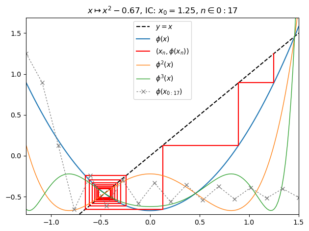
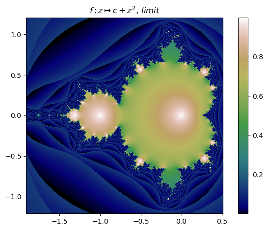
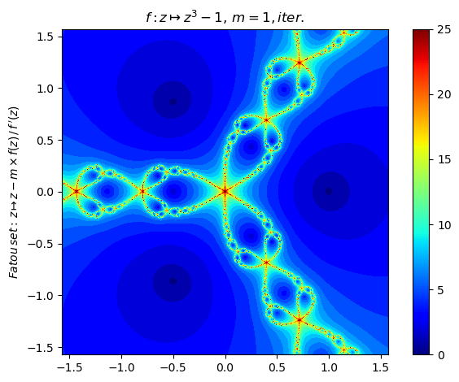
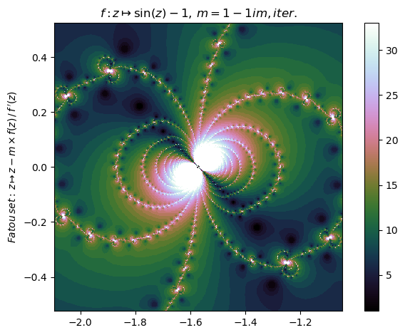

# Fatou.jl

[](https://travis-ci.org/chakravala/Fatou.jl) [](https://ci.appveyor.com/project/chakravala/fatou-jl) [](https://coveralls.io/github/chakravala/Fatou.jl?branch=master) [](http://codecov.io/github/chakravala/Fatou.jl?branch=master)

Julia package for Fatou sets. Install using `Pkg.add("Fatou")` in Julia. See [Wiki](https://github.com/chakravala/Fatou.jl/wiki) for detailed *examples*:

This package provides: `fatou`, `juliafill`, `mandelbrot`, `newton`, `basin`, `plot`, and `orbit`; along with various internal functionality using `SymPy` and Julia expressions to help compute `Fatou.FilledSet` efficiently. Full documentation is included. The `fatou` function can be applied to a `Fatou.Define` object to produce a `Fatou.FilledSet`, which can then be passed as an argument to the `plot` function of `PyPlot`. Creation of `Fatou.Define` objects is done via passing a `parse`-able function expression string (in variables `z`, `c`) and optional keyword arguments to `juliafill`, `mandelbrot`, and `newton`.

## Basic Usage

Another feature is a plot function designed to visualize real-valued-orbits. The following is a cobweb orbit plot of a function:

```Julia
juliafill("z^2-0.67",∂=[-1.25,1.5],x0=1.25,orbit=17,depth=3,n=147) |> orbit
```



With `fatou` and `plot` it is simple to display a filled in Julia set:

```Julia
c = -0.06 + 0.67im
nf = juliafill("z^2+$c",∂=[-1.5,1.5,-1,1],N=80,n=1501,cmap="gnuplot",iter=true)
plot(fatou(nf), bare=true)
```


It is also possible to switch to `mandelbrot` mode:

```Julia
mandelbrot("z^2+c",n=800,N=20,∂=[-1.91,0.51,-1.21,1.21],cmap="gist_earth") |> fatou |> plot
```



`Fatou` also provides `basin` to display the the Newton / Fatou basins using set notation in LaTeX in `IJulia`.

```Julia
map(display,[basin(newton("z^3-1"),i) for i ∈ 1:3])
```

%20=%20\left\\{z\in\mathbb{C}:\left|\\,z%20-%20\frac{z^{3}%20-%201}{3%20z^{2}}%20-%20r_i\\,\right|%3C\epsilon,\\,\forall%20r_i(\\,f(r_i)=0%20)\right\\})

%20=%20\left\\{z\in\mathbb{C}:\left|\\,z%20-%20\frac{\left(z%20-%20\frac{z^{3}%20-%201}{3%20z^{2}}\right)^{3}%20-%201}{3%20\left(z%20-%20\frac{z^{3}%20-%201}{3%20z^{2}}\right)^{2}}%20-%20\frac{z^{3}%20-%201}{3%20z^{2}}%20-%20r_i\\,\right|%3C\epsilon,\\,\forall%20r_i(\\,f(r_i)=0%20)\right\\})

%20=%20\left\\{z\in\mathbb{C}:\left|\\,z%20-%20\frac{\left(z%20-%20\frac{\left(z%20-%20\frac{z^{3}%20-%201}{3%20z^{2}}\right)^{3}%20-%201}{3%20\left(z%20-%20\frac{z^{3}%20-%201}{3%20z^{2}}\right)^{2}}%20-%20\frac{z^{3}%20-%201}{3%20z^{2}}\right)^{3}%20-%201}{3%20\left(z%20-%20\frac{\left(z%20-%20\frac{z^{3}%20-%201}{3%20z^{2}}\right)^{3}%20-%201}{3%20\left(z%20-%20\frac{z^{3}%20-%201}{3%20z^{2}}\right)^{2}}%20-%20\frac{z^{3}%20-%201}{3%20z^{2}}\right)^{2}}%20-%20\frac{\left(z%20-%20\frac{z^{3}%20-%201}{3%20z^{2}}\right)^{3}%20-%201}{3%20\left(z%20-%20\frac{z^{3}%20-%201}{3%20z^{2}}\right)^{2}}%20-%20\frac{z^{3}%20-%201}{3%20z^{2}}%20-%20r_i\\,\right|%3C\epsilon,\\,\forall%20r_i(\\,f(r_i)=0%20)\right\\})

Compute the Newton fractal Julia set for a function with annotated plot of iteration count:

```Julia
nf = newton("z^3-1",n=800,ϵ=0.1,N=25,iter=true,cmap="jet")
nf |> fatou |> plot
basin(nf,3)
```



%20=%20\left\\{z\in\mathbb{C}:\left|\\,z%20-%20\frac{\left(z%20-%20\frac{\left(z%20-%20\frac{z^{3}%20-%201}{3%20z^{2}}\right)^{3}%20-%201}{3%20\left(z%20-%20\frac{z^{3}%20-%201}{3%20z^{2}}\right)^{2}}%20-%20\frac{z^{3}%20-%201}{3%20z^{2}}\right)^{3}%20-%201}{3%20\left(z%20-%20\frac{\left(z%20-%20\frac{z^{3}%20-%201}{3%20z^{2}}\right)^{3}%20-%201}{3%20\left(z%20-%20\frac{z^{3}%20-%201}{3%20z^{2}}\right)^{2}}%20-%20\frac{z^{3}%20-%201}{3%20z^{2}}\right)^{2}}%20-%20\frac{\left(z%20-%20\frac{z^{3}%20-%201}{3%20z^{2}}\right)^{3}%20-%201}{3%20\left(z%20-%20\frac{z^{3}%20-%201}{3%20z^{2}}\right)^{2}}%20-%20\frac{z^{3}%20-%201}{3%20z^{2}}%20-%20r_i\\,\right|%3C\epsilon,\\,\forall%20r_i(\\,f(r_i)=0%20)\right\\})

Generalized Newton fractal example:

```Julia
nf = newton("sin(z)-1",m=1-1im,∂=[-2π/3,-π/3,-π/6,π/6],n=500,N=33,iter=true,ϵ=0.05,cmap="cubehelix")
nf |> fatou |> plot
basin(nf,2)
```



%20=%20\left\\{z\in\mathbb{C}:\left|\\,z%20-%20\frac{1}{\cos{\left%20(z%20\right%20)}}%20\left(1%20+%20i\right)%20\left(\sin{\left%20(z%20\right%20)}%20-%201\right)%20-%20\frac{\left(1%20+%20i\right)%20\left(\sin{\left%20(z%20-%20\frac{1}{\cos{\left%20(z%20\right%20)}}%20\left(1%20+%20i\right)%20\left(\sin{\left%20(z%20\right%20)}%20-%201\right)%20\right%20)}%20-%201\right)}{\cos{\left%20(z%20-%20\frac{1}{\cos{\left%20(z%20\right%20)}}%20\left(1%20+%20i\right)%20\left(\sin{\left%20(z%20\right%20)}%20-%201\right)%20\right%20)}}%20-%20r_i\\,\right|%3C\epsilon,\\,\forall%20r_i(\\,f(r_i)=0%20)\right\\})

## Detailed Explanation

View [Wiki](https://github.com/chakravala/Fatou.jl/wiki) for more detailed *examples*.
