# Fatou.jl

[](https://travis-ci.org/chakravala/Fatou.jl) [](https://coveralls.io/github/chakravala/Fatou.jl?branch=master) [](http://codecov.io/github/chakravala/Fatou.jl?branch=master)

Julia package for Fatou sets.

## Newton Fractals

The first type we are investigating are the Julia sets of the generalized Newton's method,

}{f%27(z)}.)

Consider the polynomial map `f = z -> z^3-1` with variable `m = 1`. To get a Julia function that applies the Newton method to this formula use `η = newton(f,m)`. Repeated function composition converges towards cube-root of 1. For example,
```Julia
julia> ζ = 2.1; [η(ζ), [(η^k)(ζ) for k ∈ 2:4]...]
4-element Array{Float64,1}:
 1.47559
 1.13681
 1.01581
 1.00024
```

This package comes with a plot function designed to visualize real-valued-orbits. The following is a cobweb orbit plot of the function with the Newton method applied to it using `orbitplot(η,[0.4 2.5 2.1],4,2,42)`:

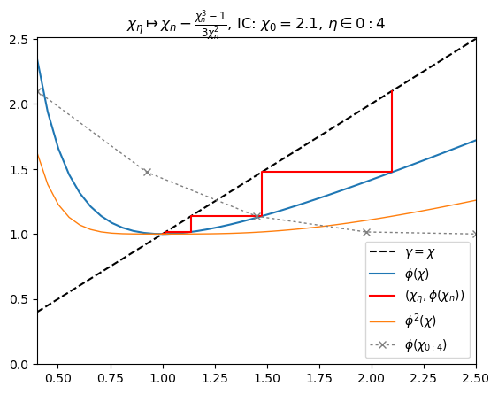

The set of points that are within an `ϵ` neighborhood of the roots `ri` of the function `f` is

%20=%20\left\\P%20z\in\mathbb{C}:%20\left|\\,z%20-%20r_i\\,\right|%3C\epsilon\\,\\,\forall%20r_i(\\,f(r_i)=0%20)\right})

`Fatou` also provides the function `nrset` to display the   the Newton basins using set notation in LaTeX in `IJulia`.

```Julia
map(display,[nrset(f,m,i) for i ∈ 1:3])
```

%20=%20\left\\{z\in\mathbb{C}:\left|\\,z%20-%20\frac{z^{3}%20-%201}{3%20z^{2}}%20-%20r_i\\,\right|%3C\epsilon,\\,\forall%20r_i(\\,f(r_i)=0%20)\right\\})

%20=%20\left\\{z\in\mathbb{C}:\left|\\,z%20-%20\frac{\left(z%20-%20\frac{z^{3}%20-%201}{3%20z^{2}}\right)^{3}%20-%201}{3%20\left(z%20-%20\frac{z^{3}%20-%201}{3%20z^{2}}\right)^{2}}%20-%20\frac{z^{3}%20-%201}{3%20z^{2}}%20-%20r_i\\,\right|%3C\epsilon,\\,\forall%20r_i(\\,f(r_i)=0%20)\right\\})

%20=%20\left\\{z\in\mathbb{C}:\left|\\,z%20-%20\frac{\left(z%20-%20\frac{\left(z%20-%20\frac{z^{3}%20-%201}{3%20z^{2}}\right)^{3}%20-%201}{3%20\left(z%20-%20\frac{z^{3}%20-%201}{3%20z^{2}}\right)^{2}}%20-%20\frac{z^{3}%20-%201}{3%20z^{2}}\right)^{3}%20-%201}{3%20\left(z%20-%20\frac{\left(z%20-%20\frac{z^{3}%20-%201}{3%20z^{2}}\right)^{3}%20-%201}{3%20\left(z%20-%20\frac{z^{3}%20-%201}{3%20z^{2}}\right)^{2}}%20-%20\frac{z^{3}%20-%201}{3%20z^{2}}\right)^{2}}%20-%20\frac{\left(z%20-%20\frac{z^{3}%20-%201}{3%20z^{2}}\right)^{3}%20-%201}{3%20\left(z%20-%20\frac{z^{3}%20-%201}{3%20z^{2}}\right)^{2}}%20-%20\frac{z^{3}%20-%201}{3%20z^{2}}%20-%20r_i\\,\right|%3C\epsilon,\\,\forall%20r_i(\\,f(r_i)=0%20)\right\\})

Now we can compute the Newton fractal Julia set for a function with annotated plot of root convergents (1):

```Julia
f=z -> z^3-1; m = 1; δ = π/2
nf = NewtonFractal(m,f,[-δ,δ,-δ,δ],800,ϵ=0.001)
PlotNF(nf,δ,f,m,c="brg"); nrset(f,m,3)
```

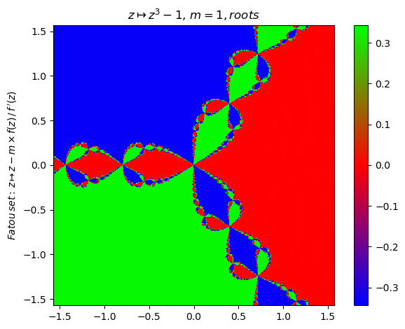

Annotated plot of iteration count:
```Julia
f=z -> z^3-1; m = 1; δ = π/2
nf = NewtonFractal(m,f,[-δ,δ,-δ,δ],800,ϵ=0.1,N=25,iter=true)
PlotNF(nf,δ,f,m,c="jet")
```

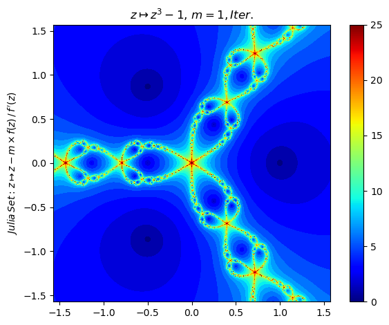

%20=%20\left\\{z\in\mathbb{C}:\left|\\,z%20-%20\frac{\left(z%20-%20\frac{\left(z%20-%20\frac{z^{3}%20-%201}{3%20z^{2}}\right)^{3}%20-%201}{3%20\left(z%20-%20\frac{z^{3}%20-%201}{3%20z^{2}}\right)^{2}}%20-%20\frac{z^{3}%20-%201}{3%20z^{2}}\right)^{3}%20-%201}{3%20\left(z%20-%20\frac{\left(z%20-%20\frac{z^{3}%20-%201}{3%20z^{2}}\right)^{3}%20-%201}{3%20\left(z%20-%20\frac{z^{3}%20-%201}{3%20z^{2}}\right)^{2}}%20-%20\frac{z^{3}%20-%201}{3%20z^{2}}\right)^{2}}%20-%20\frac{\left(z%20-%20\frac{z^{3}%20-%201}{3%20z^{2}}\right)^{3}%20-%201}{3%20\left(z%20-%20\frac{z^{3}%20-%201}{3%20z^{2}}\right)^{2}}%20-%20\frac{z^{3}%20-%201}{3%20z^{2}}%20-%20r_i\\,\right|%3C\epsilon,\\,\forall%20r_i(\\,f(r_i)=0%20)\right\\})

Now change the multiplicity parameter m from 1 to 2 (2). # Repeated function composition produces further singularities:

```Julia
f=z -> z^3-1; m = 2; δ = π/2;
orbitplot(newton(f,m), [-π 2π -1],17,3,147); PyPlot.ylim(-2,7)
nf = NewtonFractal(m,f,[-δ,δ,-δ,δ],800,N=37,ϵ=0.27,iter=true)
PlotNF(nf,δ,f,m,c="ocean")
nrset(f,m,3)
```

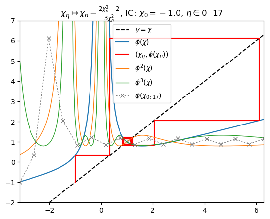
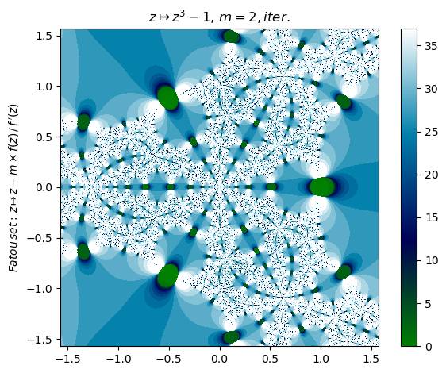

%20=%20\left\\{z\in\mathbb{C}:\left|\\,z%20-%20\frac{2%20\left(z%20-%20\frac{2%20\left(z%20-%20\frac{2%20z^{3}%20-%202}{3%20z^{2}}\right)^{3}%20-%202}{3%20\left(z%20-%20\frac{2%20z^{3}%20-%202}{3%20z^{2}}\right)^{2}}%20-%20\frac{2%20z^{3}%20-%202}{3%20z^{2}}\right)^{3}%20-%202}{3%20\left(z%20-%20\frac{2%20\left(z%20-%20\frac{2%20z^{3}%20-%202}{3%20z^{2}}\right)^{3}%20-%202}{3%20\left(z%20-%20\frac{2%20z^{3}%20-%202}{3%20z^{2}}\right)^{2}}%20-%20\frac{2%20z^{3}%20-%202}{3%20z^{2}}\right)^{2}}%20-%20\frac{2%20\left(z%20-%20\frac{2%20z^{3}%20-%202}{3%20z^{2}}\right)^{3}%20-%202}{3%20\left(z%20-%20\frac{2%20z^{3}%20-%202}{3%20z^{2}}\right)^{2}}%20-%20\frac{2%20z^{3}%20-%202}{3%20z^{2}}%20-%20r_i\\,\right|%3C\epsilon,\\,\forall%20r_i(\\,f(r_i)=0%20)\right\\})

Set multiplicity parameter to `m = -0.5` for this generalized Newton fractal (3):

```Julia
f=z -> z^3-1; m = -0.5; δ = π/2
nf = NewtonFractal(m,f,[-δ,δ,-δ,δ],500,N=10)
PlotNF(nf,δ,f,m,c="hsv")
orbitplot(newton(f,m), [-2 2 0.9],17,4,147); PyPlot.ylim(-7,2)
```


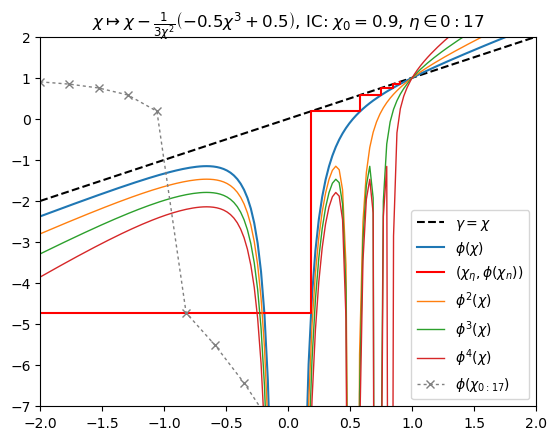

Change polynomial function (4):

```Julia
f=z -> z^3-2z-5; m = 1; δ = π/2
orbitplot(newton(f,m), [-1.5π π/2 0.2],27,2,147) PyPlot.ylim(-11,3)
nf = NewtonFractal(m,f,[-δ,δ,-δ,δ],800,ϵ=0.01,exp=0.3,iter=false)
PlotNF(nf,δ,f,m,c="RdGy")
nrset(f,m,2)
```

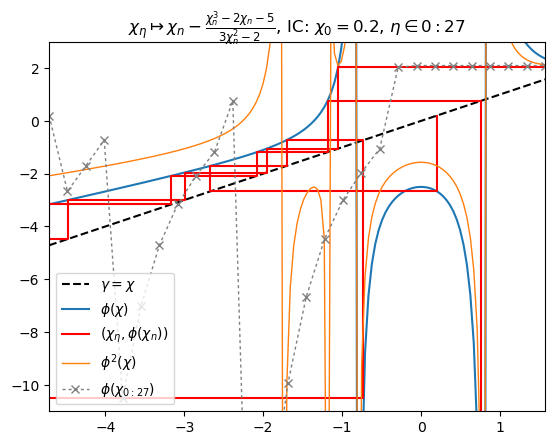
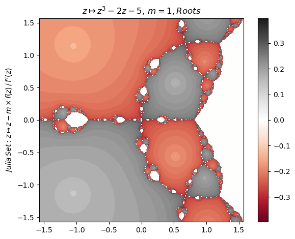

%20=%20\left\\{z\in\mathbb{C}:\left|\\,z%20-%20\frac{-%202%20z%20+%20\left(z%20-%20\frac{z^{3}%20-%202%20z%20-%205}{3%20z^{2}%20-%202}\right)^{3}%20-%205%20+%20\frac{2%20z^{3}%20-%204%20z%20-%2010}{3%20z^{2}%20-%202}}{3%20\left(z%20-%20\frac{z^{3}%20-%202%20z%20-%205}{3%20z^{2}%20-%202}\right)^{2}%20-%202}%20-%20\frac{z^{3}%20-%202%20z%20-%205}{3%20z^{2}%20-%202}%20-%20r_i\\,\right|%3C\epsilon,\\,\forall%20r_i(\\,f(r_i)=0%20)\right\\})

Generalized Newton fractal example (5):

```Julia
f=z -> z^2-1; m = 1+1im; δ = π/2.4
nf = NewtonFractal(m,f,[-δ,δ,δ,-δ],800,N=10)
PlotNF(nf,δ,f,m,c="hsv")
```

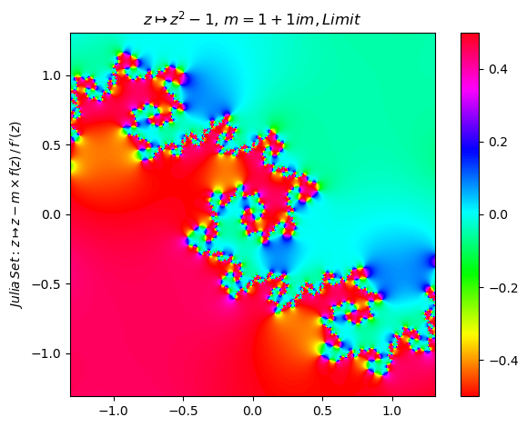

Generalized Newton fractal example (6):

```Julia
f=z -> z^2-1im; m = -0.5+2im; δ = π/2
nf = NewtonFractal(m,f,[-δ,δ,-δ,δ],200,N=10)
PlotNF(nf,δ,f,m,c="hsv")
```

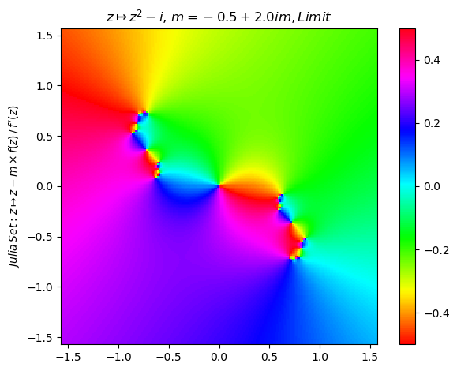

Generalized Newton fractal example (7):

```Julia
f=z -> z^8-15z^4-16; m = 1.5; ∂ = [-2π/3,0,-π/3,π/3]
orbitplot(newton(f,m), [-2π/3 0 -1.0],17,3,147); PyPlot.ylim(-3,7)
nf = NewtonFractal(m,f,∂,800,N=17,ϵ=0.01)
PlotNF(nf,∂,f,m,c="gist_stern")
nrset(f,m,1)
```
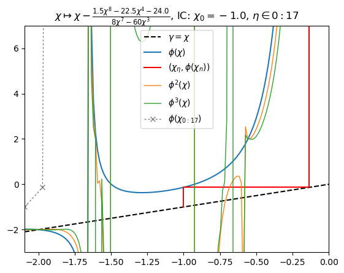
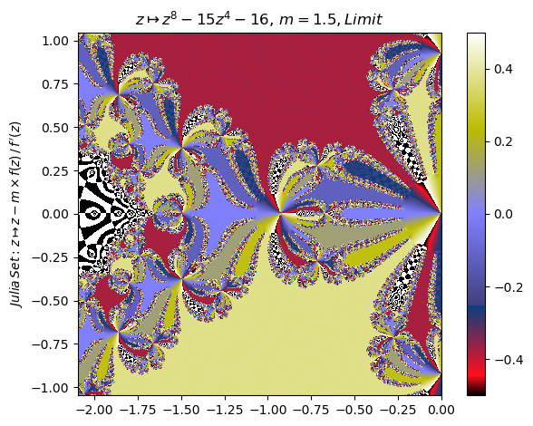

%20=%20\left\\{z\in\mathbb{C}:\left|\\,z%20-%20\frac{1.5%20z^{8}%20-%2075961.5}{8%20z^{7}}%20-%20r_i\\,\right|%3C\epsilon,\\,\forall%20r_i(\\,f(r_i)=0%20)\right\\})

Generalized Newton fractal example (8):

```Julia
f=z -> z^8-15z^4-16; m = -0.5+2im; ∂ = [-2π/3,0,-π/3,π/3]
nf = NewtonFractal(m,f,∂,500,N=10)
PlotNF(nf,δ,f,m,c="hsv")
```
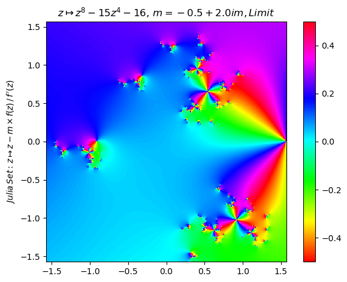

Generalized Newton fractal example (9):

```Julia
f=z -> sin(z); m = 1; ∂ = [-2π/3,-π/3,-π/6,π/6]
orbitplot(newton(f,m), [-2π/3 -π/3 -1.5],17,3,147); PyPlot.ylim(-30,30)
nf = NewtonFractal(m,f,∂,800,N=17,iter=true,ϵ=0.01)
PlotNF(nf,∂,f,m,c="gist_earth")
nrset(f,m,3)
```
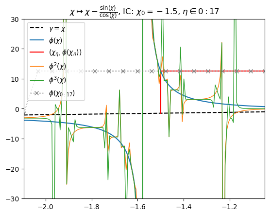
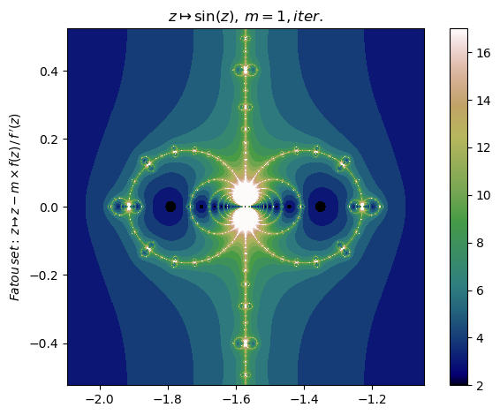

%20=%20\left\\{z\in\mathbb{C}:\left|\\,z%20-%20\frac{\sin{\left%20(z%20\right%20)}}{\cos{\left%20(z%20\right%20)}}%20-%20\frac{\sin{\left%20(z%20-%20\frac{\sin{\left%20(z%20\right%20)}}{\cos{\left%20(z%20\right%20)}}%20\right%20)}}{\cos{\left%20(z%20-%20\frac{\sin{\left%20(z%20\right%20)}}{\cos{\left%20(z%20\right%20)}}%20\right%20)}}%20+%20\frac{\sin{\left%20(-%20z%20+%20\frac{\sin{\left%20(z%20\right%20)}}{\cos{\left%20(z%20\right%20)}}%20+%20\frac{\sin{\left%20(z%20-%20\frac{\sin{\left%20(z%20\right%20)}}{\cos{\left%20(z%20\right%20)}}%20\right%20)}}{\cos{\left%20(z%20-%20\frac{\sin{\left%20(z%20\right%20)}}{\cos{\left%20(z%20\right%20)}}%20\right%20)}}%20\right%20)}}{\cos{\left%20(-%20z%20+%20\frac{\sin{\left%20(z%20\right%20)}}{\cos{\left%20(z%20\right%20)}}%20+%20\frac{\sin{\left%20(z%20-%20\frac{\sin{\left%20(z%20\right%20)}}{\cos{\left%20(z%20\right%20)}}%20\right%20)}}{\cos{\left%20(z%20-%20\frac{\sin{\left%20(z%20\right%20)}}{\cos{\left%20(z%20\right%20)}}%20\right%20)}}%20\right%20)}}%20-%20r_i\\,\right|%3C\epsilon,\\,\forall%20r_i(\\,f(r_i)=0%20)\right\\})

Generalized Newton fractal example (10):

```Julia
f=z -> sin(z)-1; m = 1+1im; ∂ = [-2π/3,-π/3,-π/6,π/6]
nf = NewtonFractal(m,f,∂,400,N=33,iter=true,ϵ=0.05)
PlotNF(nf,∂,f,m,c="cubehelix")
nrset(f,m,2)
```

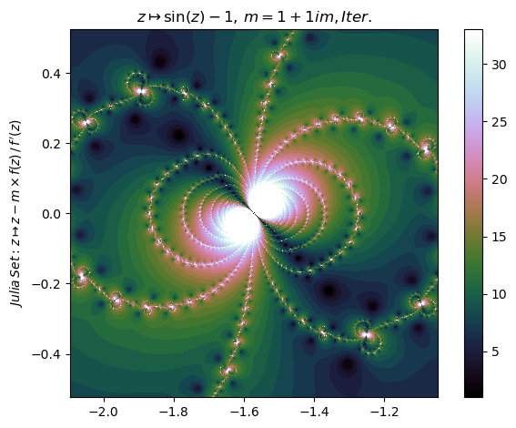

 = \left\\{z\in\mathbb{C}:\left|\\,z - \frac{1}{\cos{\left (z \right )}} \left(1 + i\right) \left(\sin{\left (z \right )} - 1\right) - \frac{\left(1 + i\right) \left(\sin{\left (z - \frac{1}{\cos{\left (z \right )}} \left(1 + i\right) \left(\sin{\left (z \right )} - 1\right) \right )} - 1\right)}{\cos{\left (z - \frac{1}{\cos{\left (z \right )}} \left(1 + i\right) \left(\sin{\left (z \right )} - 1\right) \right )}} - r_i\\,\right|<\epsilon,\\,\forall r_i(\\,f(r_i)=0 )\right\\})

Generalized Newton fractal example (11):

```Julia
f=z -> z^6+z^3-1; m = 1+0.4im; ∂ = [-0.5,0.5,-0,1]
nf = NewtonFractal(m,f,∂,800,N=33,iter=false,ϵ=0.05,exp=0.7)
PlotNF(nf,∂,f,m,c="YlGnBu")
nrset(f,m,1)
```

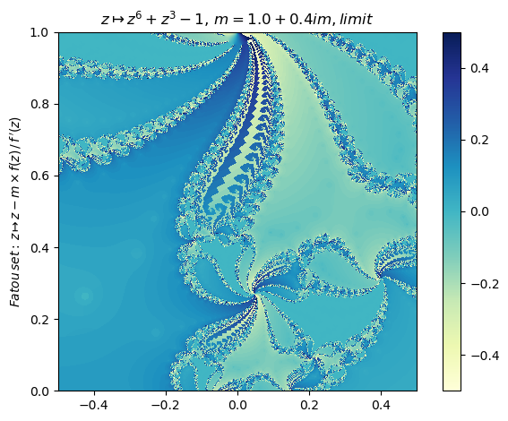

%20=%20\left\\{z\in\mathbb{C}:\left|\\,z%20-%20\frac{\left(1.0%20+%200.4%20i\right)%20\left(z^{6}%20-%20z^{3}%20-%201\right)}{6%20z^{5}%20-%203%20z^{2}}%20-%20r_i\\,\right|%3C\epsilon,\\,\forall%20r_i(\\,f(r_i)=0%20)\right\\})

Generalized Newton fractal example (12):

```Julia
f=z -> cos(z)-1; m = -0.5+2im; δ = π/2
nf = NewtonFractal(m,f,[-δ,δ,-δ,δ],350,N=15)
PlotNF(nf,δ,f,m,c="hsv")
```

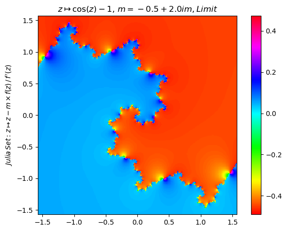

%20=%20\left\\{z\in\mathbb{C}:\left|\\,z%20+%20\frac{\cos{\left%20(z%20\right%20)}%20-%201}{\sin{\left%20(z%20\right%20)}}%20+%20\frac{\cos{\left%20(z%20+%20\frac{\cos{\left%20(z%20\right%20)}%20-%201}{\sin{\left%20(z%20\right%20)}}%20\right%20)}%20-%201}{\sin{\left%20(z%20+%20\frac{\cos{\left%20(z%20\right%20)}%20-%201}{\sin{\left%20(z%20\right%20)}}%20\right%20)}}%20-%20r_i\\,\right|%3C\epsilon,\\,\forall%20r_i(\\,f(r_i)=0%20)\right\\})

Generalized Newton fractal example (13):

```Julia
f=z -> cos(z)-1; m = 1; δ = π
nf = NewtonFractal(m,f,[-δ,δ,-δ,δ],300,N=35)
PlotNF(nf,δ,f,m,c="YlGnBu")
display(nrset(f,m,2))
orbitplot(newton(f,m), [-δ δ -2],17,3,147); PyPlot.ylim(-5,1)
```

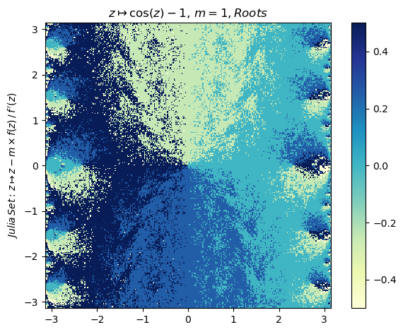
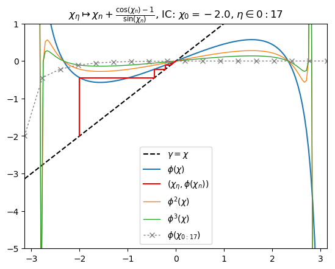

Generalized Newton fractal example (14):

```Julia
f=z -> z^5-3im*z^3-(5+2im)z^2+3z+1; m=1-0.24im; δ=2.0
nf=NewtonFractal(m,f,[-δ,δ,-δ,δ],800,ϵ=0.01,iter=true,N=27)
PlotNF(nf,δ,f,m,c="brg")
nrset(f,m,1)
```

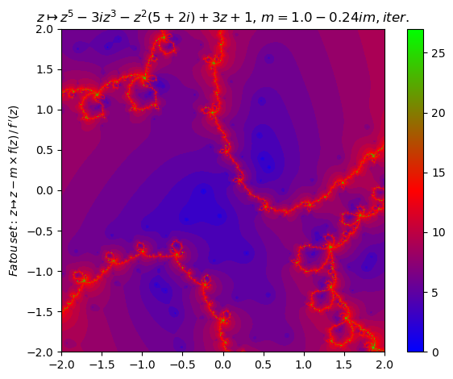

%20=%20\left\\{z\in\mathbb{C}:\left|\\,z%20-%20\frac{\left(1.0%20-%200.24%20i\right)%20\left(z^{5}%20-%203%20i%20z^{3}%20-%20z^{2}%20\left(5%20+%202%20i\right)%20+%203%20z%20+%201\right)}{5%20z^{4}%20-%209%20i%20z^{2}%20-%202%20z%20\left(5%20+%202%20i\right)%20+%203}%20-%20r_i\\,\right|%3C\epsilon,\\,\forall%20r_i(\\,f(r_i)=0%20)\right\\})

Generalized Newton fractal example (15):

```Julia
f=z -> log(z); m=1+1im; δ=2π
nf=NewtonFractal(m,f,[-δ,δ,-δ,δ],500,ϵ=0.01,iter=false,N=27)
PlotNF(nf,δ,f,m,c="brg")
nrset(f,m,1)
```

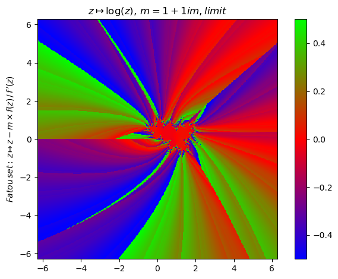

%20=%20\left\\{z\in\mathbb{C}:\left|\\,-%20z%20\left(1%20-%20i\right)%20\log{\left%20(z%20\right%20)}%20+%20z%20-%20r_i\\,\right|%3C\epsilon,\\,\forall%20r_i(\\,f(r_i)=0%20)\right\\})

Generalized Newton fractal example (16):

```Julia
f=z -> z^(4+3im)-1; m=2.1; δ=π
nf=NewtonFractal(m,f,[-δ,δ,-δ,δ],500,ϵ=0.01,iter=false,N=27)
PlotNF(nf,δ,f,m,c="terrain")
nrset(f,m,1)
```
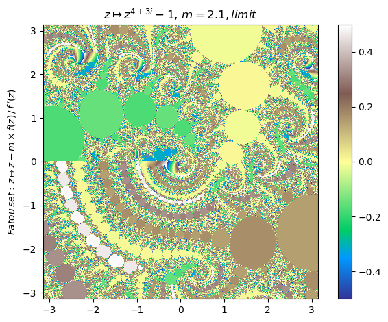

%20=%20\left\\{z\in\mathbb{C}:\left|\\,-%20\frac{z%20z^{-4%20-%203%20i}}{4%20+%203%20i}%20\left(2.1%20z^{4%20+%203%20i}%20-%202.1\right)%20+%20z%20-%20r_i\\,\right|%3C\epsilon,\\,\forall%20r_i(\\,f(r_i)=0%20)\right\\})

Generalized Newton fractal example (17):

```Julia
f=z -> e^z+1; m=1; δ=2π
nf=NewtonFractal(m,f,[-δ,δ,-δ,δ],500,ϵ=0.01,iter=true,N=27)
PlotNF(nf,δ,f,m,c="brg")
nrset(f,m,1)
```

%20=%20\left\\{z\in\mathbb{C}:\left|\\,z%20-%20\left(e^{z}%20+%201\right)%20e^{-%20z}%20-%20\left(e^{z%20-%20\left(e^{z}%20+%201\right)%20e^{-%20z}}%20+%201\right)%20e^{-%20z%20+%20\left(e^{z}%20+%201\right)%20e^{-%20z}}%20-%20r_i\\,\right|%3C\epsilon,\\,\forall%20r_i(\\\,f(r_i)=0%20)\right\\})

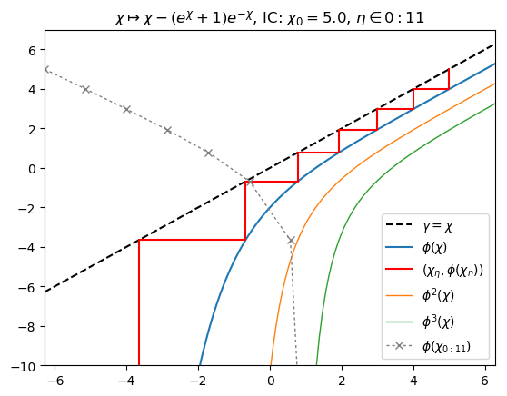
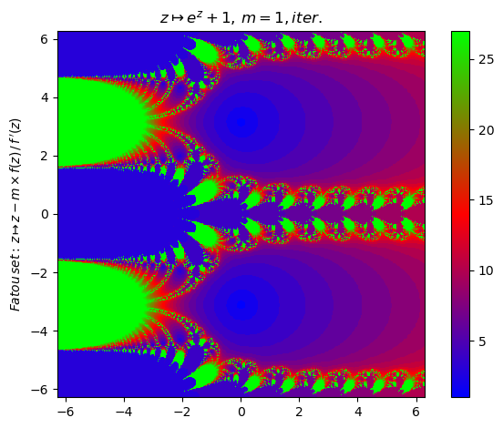
